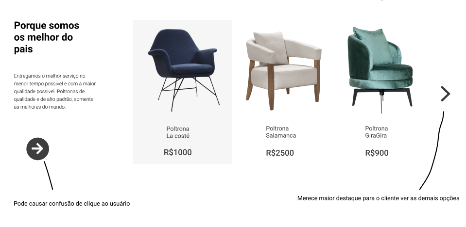
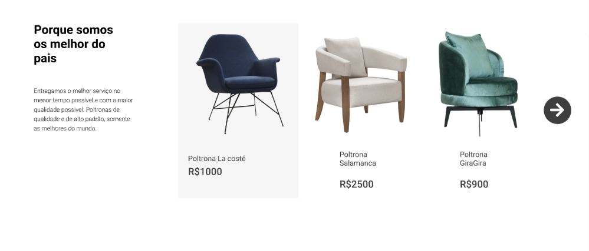
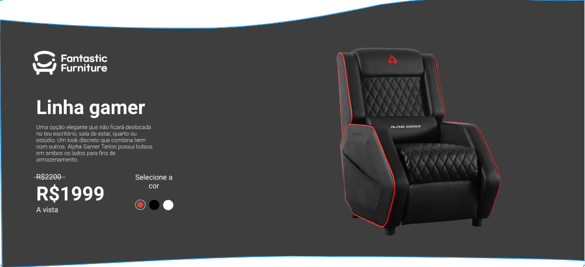
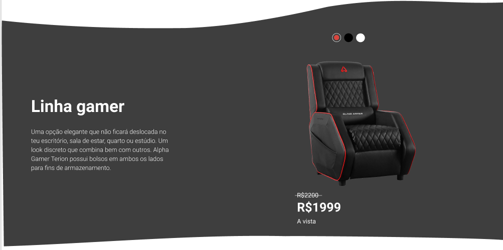
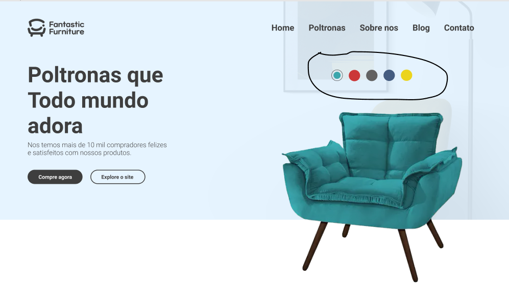
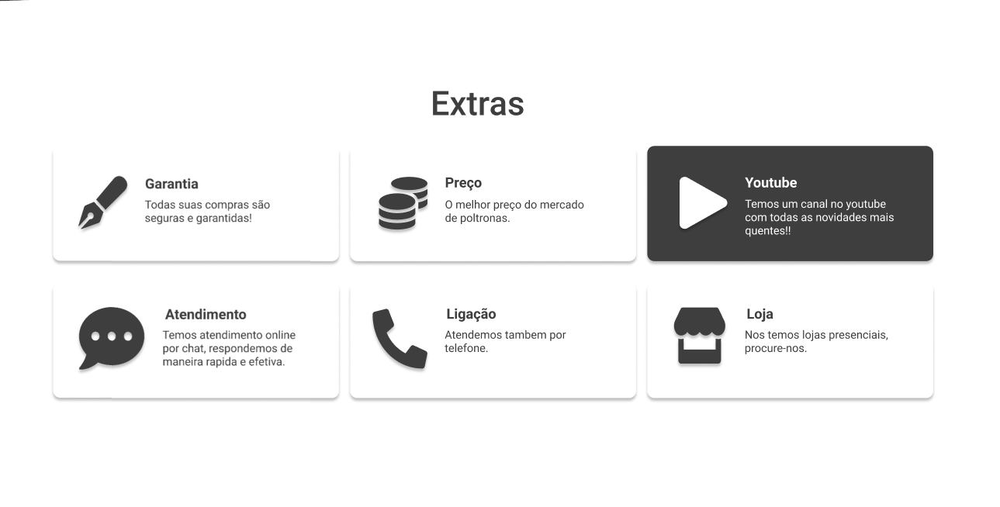
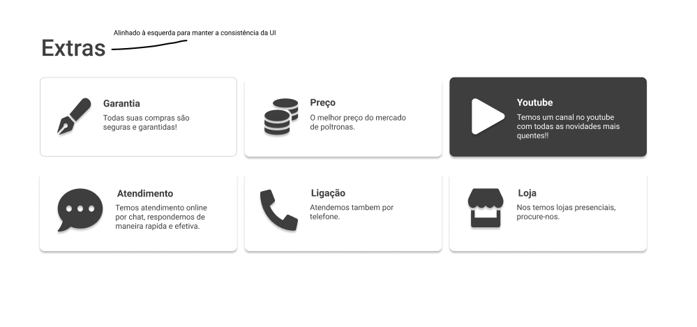

# Fantastic Furniture

---
[Acesse a aplicação em produção](https://marcosmacedoo.github.io/fantastic-furniture/)

---

## Instalação
- `git clone git@github.com:marcosmacedoo/fantastic-furniture.git`
- `npm install` ou `yarn`
- `npm run start` ou `yarn start`
- Acesse `http://localhost:3000/`

---

## Mudanças na UI
Fiz algumas pequenas mudanças em prol de melhorar a usabilidade e dar consistência a UI do Fantastic Furniture.

### Melhorando o entendimento para utilizar o Carousel
Antes

Depois

> O ícone embaixo do texto de "Porque somos os melhor..." pode causar confusão ao usuário. Pois pode pensar que seja o botão do carousel de poltronas e clicar, no entanto, o verdadeiro botão está a direita da listagem de poltronas. Ele também não possui o destaque necessário para chamar atenção de primeira do usuário.

### Padronizando a de escolha de cores das poltronas
Antes

Depois

> Na seção de início, a escolha de cores para as poltronas está encima da imagem. Então o usuário ao prosseguir na Landing Page esperará que a escolha de cores estará encima da imagem novamente e não ao lodo (como está na foto de antes). E também manter a escolha de cores acima da imagem é uma questão de consistência para a UI.

Imagem da seção de início mencionada acima

### Padronizando o título da seção de Extras
Antes

Depois

> Em toda a Landing Page os títulos de cada seção são alinhados à esquerda, exceto a seção de Extras. Isso causa uma quebra na consistência. Então o título da seção Extras foi alinhado à esquerda para manter a consistência.

---

## MockAPI
Utilizei o [mockAPI](https://mockapi.io/) para mockar alguns dados.

Url base `https://6154fe692473940017efb04b.mockapi.io/api/`

Endpoints:
- `https://6154fe692473940017efb04b.mockapi.io/api/seats-section-gamer`
- `https://6154fe692473940017efb04b.mockapi.io/api/seats-section-main`
- `https://6154fe692473940017efb04b.mockapi.io/api/seats-section-carousel-seats`
- `https://6154fe692473940017efb04b.mockapi.io/api/seats-section-extras`
